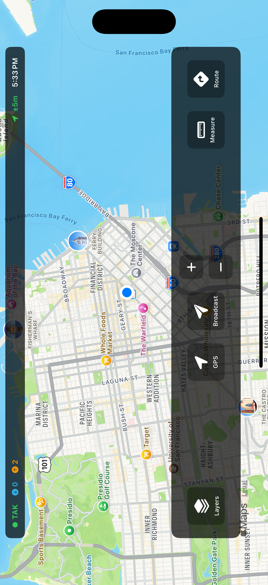
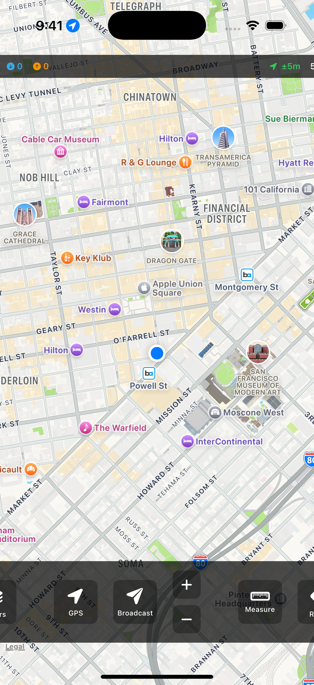
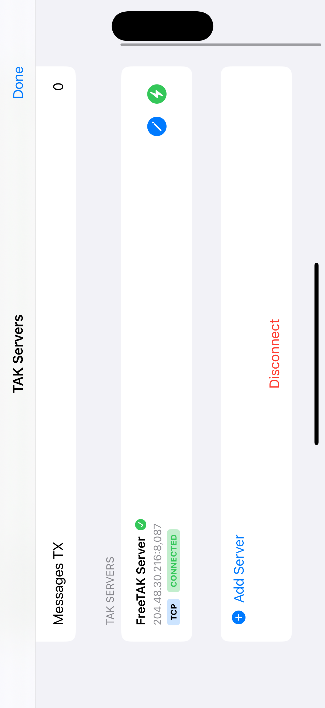

# Omni-BASE

[](./LICENSE.md)
[]()
[]()
[](https://swift.org)
[](https://www.rust-lang.org/)

**Omni-BASE is a cross-platform TAK (Team Awareness Kit) client built with Rust and native mobile frameworks.** It provides full ATAK-compatible tactical map functionality with multi-server management, real-time CoT (Cursor on Target) messaging, and a modern native UI.

## Features

### 🗺️ Tactical Map Interface
- **ATAK-style UI** - Professional tactical map interface mirroring ATAK's design
- **MapKit Integration** - Native iOS mapping with satellite, hybrid, and standard views
- **Real-time CoT Markers** - Live position updates with color-coded unit types (friendly/hostile/unknown)
- **GPS Tracking** - Real-time location with accuracy indicators
- **Interactive Controls** - Zoom, pan, layer switching, and GPS centering

### 📡 Multi-Server Management
- **Server Configuration** - Add, edit, and delete multiple TAK servers
- **Persistent Storage** - Server configurations saved locally with UserDefaults
- **One-Tap Switching** - Quickly switch between configured servers
- **Connection Status** - Real-time indicators showing active connections
- **Protocol Support** - TCP/UDP with optional TLS encryption
- **Active Server Display** - Current server name shown in status bar

### 💬 CoT Messaging
- **XML Parser** - Parse and display CoT messages from TAK servers
- **Broadcast Position** - Send self-position updates with full metadata
- **Event Tracking** - Monitor sent and received message counts
- **Type Filtering** - Filter units by affiliation (friendly, hostile, unknown)

### 🎨 User Interface
- **Responsive Design** - Works in portrait and landscape orientations
- **Status Bar** - Real-time connection status, message counts, GPS accuracy, time
- **Bottom Toolbar** - Quick access to GPS, broadcast, zoom, layers, measure, and route tools
- **Layers Panel** - Toggle map types and unit overlays with visual feedback
- **Haptic Feedback** - Tactile response for all button interactions
- **Dark Mode Ready** - Semi-transparent overlays optimized for tactical use

## Architecture

### Core Components

```
omni-BASE/
├── apps/
│   └── omnitak_ios_test/        # Native iOS app
│       ├── OmniTAKTest/
│       │   ├── OmniTAKTestApp.swift      # App entry point
│       │   ├── MapViewController.swift   # Main ATAK interface (800+ lines)
│       │   ├── TAKService.swift          # TAK server integration
│       │   ├── ServerManager.swift       # Multi-server management
│       │   └── Info.plist                # Location permissions
│       └── OmniTAKMobile.xcframework     # Rust FFI bindings
└── modules/
    └── omnitak_mobile/           # Rust core library
```

### Technology Stack

- **Frontend**: SwiftUI + UIKit (iOS)
- **Core Library**: Rust (cross-platform)
- **FFI**: C bindings via XCFramework
- **Mapping**: MapKit (iOS native)
- **Location**: CoreLocation
- **Storage**: UserDefaults (local persistence)
- **Protocol**: TCP/UDP with TAK CoT XML

## Quick Start

### Prerequisites

- Xcode 15.0+
- iOS 15.0+ deployment target
- Rust toolchain (for building core library)
- macOS with Apple Silicon or Intel

### Installation

1. **Clone the repository:**
   ```bash
   git clone https://github.com/engindearing-projects/omni-BASE.git
   cd omni-BASE
   ```

2. **Build the Rust core library:**
   ```bash
   cd modules/omnitak_mobile
   ./build_ios.sh
   ```

3. **Open the iOS project:**
   ```bash
   cd ../../apps/omnitak_ios_test
   open OmniTAKTest.xcodeproj
   ```

4. **Configure signing:**
   - Select the OmniTAKTest target
   - Go to "Signing & Capabilities"
   - Select your Team

5. **Build and run:**
   - Select iPhone simulator or device
   - Press Cmd+R to build and run

### Using the App

1. **Launch** - App auto-connects to default FreeTAK Server
2. **View Map** - Satellite imagery with tactical overlays
3. **Manage Servers** - Tap status bar to access server list
4. **Add Server** - Tap "+" to configure new TAK server
5. **Switch Servers** - Tap bolt icon to connect to different server
6. **Broadcast Position** - Tap "Broadcast" to send CoT update
7. **Toggle Layers** - Tap "Layers" to change map type and unit filters

## Configuration

### Default TAK Server

The app ships with a default FreeTAK Server configuration:

```swift
TAKServer(
    name: "FreeTAK Server",
    host: "204.48.30.216",
    port: 8087,
    protocolType: "tcp",
    useTLS: false
)
```

### Adding Custom Servers

1. Open server list (tap status bar)
2. Tap "Add Server" (+)
3. Enter server details:
   - Name (e.g., "My TAK Server")
   - Host (IP address or hostname)
   - Port (default: 8087)
   - Protocol (TCP or UDP)
   - TLS (toggle if using SSL/TLS)
4. Tap "Save Server"

## Screenshots

### Main Tactical Map
<p align="center">
  
</p>

*Satellite view with GPS tracking, CoT markers, and tactical overlays*

### Map Layers & Views

<p align="center">
  
  
</p>

*Left: Layers panel with map type and unit filters | Right: Standard map view*

### Server Management
<p align="center">
  
</p>

*TAK Servers management with connection status and server switching*

## Development

### Project Structure

- **MapViewController.swift** (800+ lines)
  - ATAKMapView: Main map with UIViewRepresentable wrapper
  - ATAKStatusBar: Connection status and metrics
  - ATAKBottomToolbar: Quick action buttons
  - ATAKSidePanel: Layers and overlays
  - ServerConfigView: Multi-server management
  - ServerEditView: Add/edit server dialog

- **TAKService.swift**
  - Rust FFI integration
  - CoT XML parsing
  - Server connection management
  - Event callbacks

- **ServerManager.swift**
  - Server CRUD operations
  - Persistent storage
  - Active server tracking

### Building from Source

```bash
# Build Rust library for iOS
cd modules/omnitak_mobile
./build_ios.sh

# Build iOS app with Xcode CLI
cd ../../apps/omnitak_ios_test
xcodebuild -project OmniTAKTest.xcodeproj \
           -scheme OmniTAKTest \
           -configuration Debug \
           -destination 'platform=iOS Simulator,name=iPhone 16 Pro' \
           build
```

### Running Tests

```bash
# Install on simulator
xcrun simctl install "iPhone 16 Pro" \
  "$(find ~/Library/Developer/Xcode/DerivedData/OmniTAKTest-*/Build/Products/Debug-iphonesimulator/OmniTAKTest.app | head -1)"

# Launch app
xcrun simctl launch "iPhone 16 Pro" com.engindearing.omnitak.test
```

## Roadmap

- [ ] Android implementation
- [ ] Advanced CoT filtering and search
- [ ] Offline map caching
- [ ] Drawing tools (routes, markers, shapes)
- [ ] Team chat integration
- [ ] File sharing and attachments
- [ ] Mission planning tools
- [ ] Integration with external sensors
- [ ] Data replay and simulation

## Contributing

We welcome contributions! Please follow these guidelines:

1. Fork the repository
2. Create a feature branch (`git checkout -b feature/amazing-feature`)
3. Commit your changes (`git commit -m 'Add amazing feature'`)
4. Push to the branch (`git push origin feature/amazing-feature`)
5. Open a Pull Request

## License

This project is licensed under the MIT License - see the [LICENSE.md](LICENSE.md) file for details.

## Acknowledgments

- Built with Rust for cross-platform core functionality
- Uses MapKit for native iOS mapping
- Compatible with TAK CoT XML protocol
- Inspired by ATAK's tactical UI/UX design

## Support

For questions, issues, or feature requests:
- Open an issue on GitHub
- Contact: [Engineering Projects](https://github.com/engindearing-projects)

---

**Note**: This is an alpha release. Features are under active development and APIs may change.
